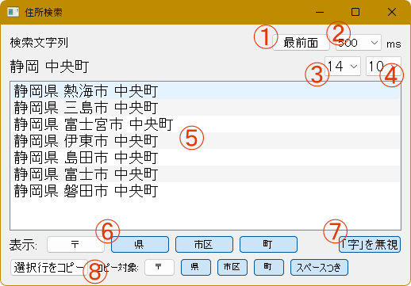

# address_search.py
 
address_search.py は、クリップボード内のテキストから住所を検索して表示する Python スクリプトです。


たとえば、手書きされた住所を PC に入力しているときに、達筆な方の筆跡を判別できないことはよくあります (よね)。そんなときに、分かる (読める) ところだけ入力して住所検索するためのツールです。

ネットで検索してもいいんですが、入力する住所が大量にあってウィンドウを移動したりコピペしたりといった操作が煩わしいときや、キーからもう手を離したくないときなどに便利です。

## 動作環境 (確認済)

* Windows 環境
* Python 3

最新バージョンは Windows 11 24H2 + Python 3.10.6 で動作確認しています。

## 変更履歴

(2024/12/29) 最新バージョンは 1.1.0 です。このバージョンで追加・廃止された機能は次のとおりです。

* リストに表示する住所に対して、郵便番号、県、市区、町のフィルタを適用できるようになりました。
* 「字」の文字を無視するかどうかを選択できるようになりました (通常検索と AND 検索。「大字」はこれまでどおり常に無視されます)。
* 検索結果の住所を選択してクリップボードにコピーできるようになりました。
* ウィンドウサイズが変更可能になり、ウィンドウの位置とサイズをアプリ終了時に記憶するようになりました。
* ファジー検索は廃止されました。

検索速度はあまり変わってません。

## インストール・実行方法

1. 必要に応じて、venv などしてください。

2. このスクリプトでは `pyperclip` と `PyQt5` のライブラリを使用しますので、これらを pip install してください。

```
pip install pyperclip PyQt5
```

3. 本リポジトリをダウンロード・展開してください。

4. 住所データは日本郵便の郵便番号データを使います。[こちら](https://www.post.japanpost.jp/zipcode/dl/utf-zip.html) のページ (日本郵便) でダウンロードして、スクリプトと同じフォルダに置いてください (UTF-8 形式のものです)。

5. スクリプトを実行します。
```
python address_search.py
```

## 使い方

**重要**： 入力作業などに集中できるように (ウィンドウにフォーカスを移動しなくても検索できるように)、本スクリプトはクリップボードを常に監視しながら動作します。使用しないときはスクリプトを終了するか、タイマーをオフにすることをお勧めします。

### 各ボタンの機能

スクリプトを実行すると次のようなウィンドウが表示されます。



各ボタンの機能は次のとおりです (ラベルがないのは手抜きです)。

1. [最前面]: ウィンドウを最前面表示するトグルボタンです (ラベルのとおり)。

2. クリップボードを監視する間隔 (ミリ秒単位) を選択するドロップボックスです。`0` を選択するとクリップボードの監視を停止します。

3. フォントサイズを選択するドロップダウンボックス。

4. 検索結果の表示件数を選択するドロップボックス。件数が少ない方が検索が速いとかはないです。常に北 → 南の順に表示するので、あまり意味がないかもれしれません。

5. 検索で見つかった住所の一覧が表示されます。

6. 表示する項目のフィルタボタン。

7. このトグルボタンをオンにすると、検索文字列に含まれる「字」の文字を無視します。「一文字町」のように「字」を含む地名を検索したい場合は、このボタンをオフにしてください。

8. リストで選択した住所をクリップボードにコピーします。横のトグルボタンでコピー対象を選択できます。[スペースつき] をオンにすると、各項目の間に半角スペースを挿入します。

メモ： リスト表示とコピー操作に使用するフィルタは独立しています。つまり、[コピー対象] で [県] を選択している場合は、リストに県が表示されていなくても、コピーされるテキストには県名が含まれます。

### 検索方法

クリップボードが更新されると検索がトリガーされます。改行を含む文字列は検索できません。

検索には、通常検索、AND 検索、正規表現検索を利用できます。

通常検索： 文字列を 1 つ指定します (クリップボードにコピーします)。その文字列を含む住所が表示されます。

AND 検索： 文字列をスペースで区切って指定します (クリップボードにコピーします)。文字列をすべて含む住所が表示されます。文字列の順序は考慮されません。「奈良 柳本」でも「柳本 奈良」でも同じ結果になります。

正規表現検索： 正規表現を表す文字列の末尾に「r」を付けます。例:「市.+緑台r」

通常検索と AND 検索では、「大字」の文字は無視されます。また、いずれの検索でも「カ」と「ヵ」、「ケ」と「ヶ」、「ノ」と「の」、「ツ」と「ッ」はそれぞれ同一視されます。

### ウィンドウの位置・サイズの保存と復元

アプリケーション終了時にウィンドウの位置とサイズを記録して、次回の起動時に同じ状態でウィンドウを開きます。

これらの情報は、同じフォルダの ``address_search.ini`` ファイルに保存されます。

## 使用上の注意

郵便番号データを使用する関係上、郵便番号がひとまとめになってる地域は検索できない場合あります (日本郵便の郵便番号検索で「以下に掲載がない場合」に該当するケースです)。

国土交通省の「位置参照情報」データを使用すると、もう少し詳しく住所を拾える場合があります (あるかも)。参考用にデータを作成しましたので、よければ使ってみてください。データ形式を統一すればよかったんですが、ほかに使い回しすることもないですし (面倒くさかったので) 別のスクリプトとして作成しました。

※ 国交省版は現在、バージョン 1.0.0 の仕様のままです。

```
python address_search_mlit.py
```

データファイルは ``combined_result.csv`` です。使い方や画面は同じですが、郵便番号は表示されません。

こちらのデータは、「国土数値情報 (位置参照情報)」(国土交通省) (https://nlftp.mlit.go.jp/cgi-bin/isj/dls/_choose_method.cgi) を加工して作成しました。

## 免責事項

当ソフトウェアの使用に関連して生じたいかなる損害、損失、またはトラブルについても、一切の責任を負いません。これには、データの損失、収益の損失、ビジネスの中断、およびその他の金銭的損失が含まれますが、これに限られません。

## 出典情報・その他

 国土交通省国土数値情報ダウンロードサイト (https://nlftp.mlit.go.jp/cgi-bin/isj/dls/_choose_method.cgi)

本スクリプトおよび補助ツールなど (Ver 1.0.0 まで) の作成にあたっては、Claude 3.5 Sonnet を利用しています。

## ライセンス

このリポジトリの内容は [MT License](./LICENSE) です。
