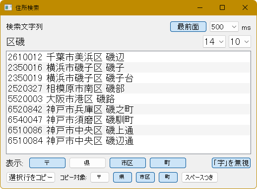

# address_search.py
 
address_search.py は、クリップボード内のテキストから住所を検索して表示する Python スクリプトです。




たとえば、手書きされた住所を PC に入力しているときに、達筆な方の筆跡を判別できないことはよくあります (よね)。そんなときに、分かる (読める) ところだけ入力して住所検索するためのツールです。

ネットで検索してもいいんですが、入力する住所が大量にあってウィンドウを移動したりコピペしたりといった操作が煩わしいときや、キーからもう手を離したくないときなどに便利です (かもしれません)。

## 動作環境

* Windows 10 環境

* Pythonn (3.10.6 で動作確認しています)

## インストール

1. 必要に応じて、venv などしてください。

2. このスクリプトでは `fuzzywuzzy`、`python-Levenshtein`、`pyperclip`、および `PyQt5` のライブラリを使用します。これらを pip install します。
```
pip install fuzzywuzzy python-Levenshtein pyperclip PyQt5
```

3. リポジトリを zip でダウンロードして展開します。

4. 住所データは日本郵便の郵便番号データを使います。[こちら](https://www.post.japanpost.jp/zipcode/dl/utf-zip.html) のページ (日本郵便) でダウンロードして、スクリプトと同じフォルダに置いてください (UTF-8 形式のものです)。

5. スクリプトを実行します。
```
python address_search.py
```

## 使い方

**重要**： 入力作業などに集中できるように (ウィンドウにフォーカスを移動しなくても検索できるように)、本スクリプトはクリップボードを常に監視しながら動作します。使用しないときはスクリプトを終了するか、タイマーをオフにすることをお勧めします。

スクリプトを実行すると次のようなウィンドウが表示され、ここに検索文字列と検索結果のリストが表示されます。


画面右上の各ボタンの機能は次のとおりです (ラベルがないのは手抜きです)。

1. [最前面]: ウィンドウを最前面表示するトグルボタンです (ラベルのとおり)。

2. クリップボードを監視する間隔 (ミリ秒単位) を選択するドロップボックスです。`0` を選択するとクリップボードの監視を停止します。

3. フォントサイズを選択するドロップダウンボックス。

4. 検索結果の表示件数を選択するドロップボックス。件数が少ない方が検索が速いとかはないです。常に北 → 南の順に表示するので、あまり意味がないかもれしれません。

クリップボードが更新されると検索がトリガーされます。コピー操作をしてもクリップボードの内容に変更がなければ検索は実行されません。また、改行を含む文字列は検索できません。

検索には、通常検索、AND 検索、正規表現検索、あいまい検索を利用できます。

通常検索： 文字列を 1 つ指定します (クリップボードにコピーします)。その文字列を含む住所が表示されます。

AND 検索： 文字列をスペースで区切って指定します (クリップボードにコピーします)。文字列をすべて含む住所が表示されます。文字列の順序は考慮されません。「奈良 柳本」でも「柳本 奈良」でも同じ結果になります。

正規表現検索： 正規表現を表す文字列の末尾に「r」を付けます。例:「市.+緑台r」

あいまい検索： 文字列の末尾に「f」を付けるとレーベンシュタイン距離を計算して、結果をスコアの高い順に表示します。検索に結構時間かかります (正規表現まであれば十分な気もします)。例:「須磨区磯**馬**町f」(→「神戸市須磨区磯**馴**町」がヒットします)

通常検索と AND 検索では、「大字」の文字は無視されます。また、いずれの検索でも「カ」と「ヵ」、「ケ」と「ヶ」、「ノ」と「の」、「ツ」と「ッ」はそれぞれ同一視されます。

## 使用上の注意

郵便番号データを使用する関係上、郵便番号がひとまとめになってる地域は検索できない場合あります (日本郵便の郵便番号検索で「以下に掲載がない場合」に該当するケースです)。ご注意ください。

## 免責事項

当ソフトウェアの使用に関連して生じたいかなる損害、損失、またはトラブルについても、一切の責任を負いません。これには、データの損失、収益の損失、ビジネスの中断、およびその他の金銭的損失が含まれますが、これに限られません。

## ライセンス

このリポジトリの内容は [MT License](./LICENSE) です。
